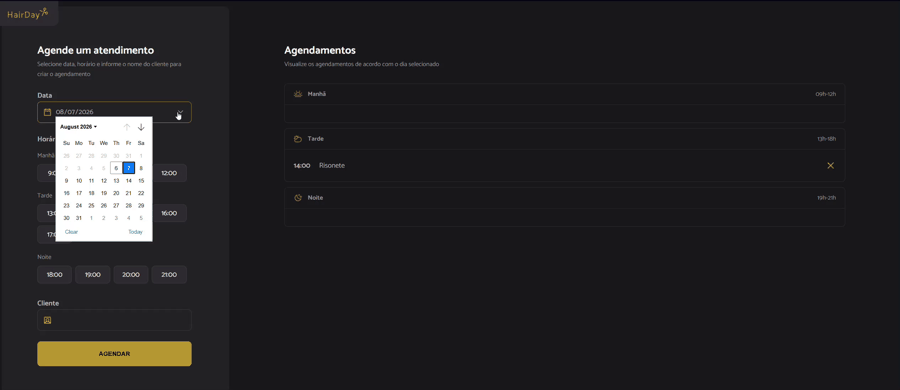

# 💈 Hair Day


Sistema de agendamento para barbearia/salão desenvolvido com JavaScript moderno, utilizando Webpack para modularização e JSON Server para simular uma API REST.

O projeto permite que usuários realizem, consultem e cancelem agendamentos de forma simples, simulando o fluxo de uma aplicação real.

---

## 📸 Preview




## 🚀 Demo

Acesse a aplicação:

https://ruanvclima.github.io/project-hair-day/

---

## ✨ Funcionalidades

- Agendamento de horários
- Validação de data e horário
- Listagem dos agendamentos
- Busca de horários cadastrados
- Cancelamento de agendamentos
- Persistência dos dados utilizando JSON Server
- Interface responsiva

---

## 🛠 Tecnologias

- HTML5
- CSS3
- JavaScript (ES6+)
- Webpack
- JSON Server
- Babel

---

## 📂 Estrutura do Projeto

```
project-hair-day
│
├── dist/
├── src/
│   ├── assets/
│   ├── services/
│   ├── modules/
│   ├── styles/
│   └── main.js
│
├── server.json
├── package.json
└── webpack.config.js
```

---

## ⚙️ Como executar

### Clone o projeto

```bash
git clone https://github.com/RuanVCLima/project-hair-day.git
```

Entre na pasta

```bash
cd project-hair-day
```

Instale as dependências

```bash
npm install
```

Inicie o JSON Server

```bash
npx json-server server.json
```

Em outro terminal, execute o projeto

```bash
npm run dev
```

A aplicação estará disponível em

```
http://localhost:3000
```

---

## 📚 Aprendizados

Durante o desenvolvimento deste projeto foi possível praticar:

- Organização de projetos JavaScript
- Arquitetura modular
- Manipulação do DOM
- Programação assíncrona
- Consumo de APIs REST
- Webpack
- Manipulação de datas
- Validação de formulários
- Boas práticas de desenvolvimento Front-end

---

## 🎯 Próximas melhorias

- [ ] Editar agendamentos
- [ ] Sistema de autenticação
- [ ] Banco de dados real
- [ ] Responsividade para tablets
- [ ] Testes automatizados

---

## 👨‍💻 Autor

**Ruan Victor Cabral de Lima**

LinkedIn

https://www.linkedin.com/in/ruan-victor/

GitHub

https://github.com/RuanVCLima

---

## 📄 Licença

Este projeto foi desenvolvido para fins de estudo e prática de desenvolvimento Front-end.
